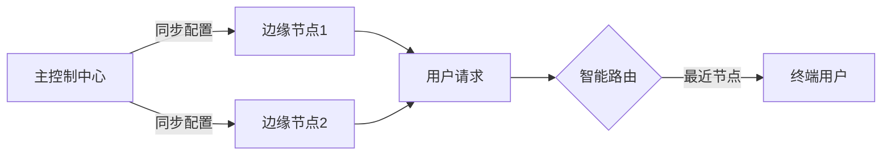

# 🌐 EdgeOne Pages + Typecho 60秒日报插件集成方案

## 🎯 方案优势
| 特性 | 说明 |
|------|------|
| ⚡ 全球加速 | 利用全球边缘节点实现毫秒级响应 |
| 🤖 自动化 | 每日自动获取并发布新闻简报 |
| 🎨 开箱即用 | 精美预设样式，无需额外设计 |
| 🔒 合规授权 | AGPL-3.0 协议保障使用权利 |

## 📜 许可证声明
> 📌 **重要声明**  
> 本软件采用 `AGPL-3.0` 许可证，同时**严格禁止**：
> - 直接售卖软件本体
> - 提供付费下载服务
> - 以订阅方式盈利  
> 
> ✅ **允许**：自由使用、修改和二次分发

## 🛠️ 安装部署

### 1. 文件结构
```text
.
├── 60s.php                 # 主程序文件
├── usr/
│   └── uploads/
│       └── 60s/            # 图片存储目录
└── typecho/                # 您的Typecho目录
```

### 2. 边缘函数配置
```javascript
// EdgeOne边缘函数示例
addEventListener('scheduled', event => {
  event.waitUntil(
    handleSchedule(event.scheduledTime)
  )
})

async function handleSchedule(timestamp) {
  await fetch('https://您的域名/60s.php', {
    cf: { cacheTtl: 86400 }
  })
}
```

## ⚙️ 核心配置

### 基础设置
```php
// 📅 日期标题
$title = date('Y年m月d日').' 每日60秒简报';

// 🖼️ 图片模式
$useRemoteImage = false;  // true=远程CDN图片 | false=本地存储

// 📂 本地存储路径
$localImageBasePath = '/usr/uploads/60s/';
```

### 内容样式模板
```html
<div style="
  background: linear-gradient(135deg, #f5f7fa 0%, #c3cfe2 100%);
  border-left: 4px solid #4e73ff;
  padding: 1.5rem;
  border-radius: 0.5rem;
  margin: 1rem 0;
">
  <p style="font-size: 1.1rem; color: #2d3748;">
    💡 {{每日新闻内容}}
  </p>
</div>
```

## ⏰ 自动化方案

### 方案对比
| 方式 | 触发条件 | 适用场景 |
|------|----------|----------|
| 🕒 EdgeOne定时器 | 边缘节点触发 | 全球分布式部署 |
| 🖥️ 服务器Cron | 本地crontab | 单服务器架构 |
| 🌐 HTTP访问 | 手动访问URL | 测试环境 |

**推荐配置**：
```bash
# 宝塔面板定时任务
0 8 * * * php /www/wwwroot/your-site/60s.php >> /var/log/60s.log
```

## 🧰 高级功能

### 多MCP协同架构


### 性能优化建议
1. 🖼️ 启用WebP自动转换
   ```nginx
   # EdgeOne规则引擎配置
   image_optimize {
     webp on;
     quality 85;
   }
   ```
2. 📦 Brotli压缩
3. 🗺️ 智能路由

## ❓ 常见问题

### 图片显示异常
**现象**：图片加载失败  
✅ **解决方案**：
1. 检查目录权限：`chmod -R 755 /usr/uploads`
2. 临时切换远程模式：
   ```php
   $useRemoteImage = true;  // 测试API可用性
   ```

### 内容样式调整
通过修改CSS变量快速定制：
```css
:root {
  --primary-color: #4e73ff;
  --secondary-color: #f8f9fc;
  --border-radius: 0.5rem;
}
```

## 🚀 未来路线图
- [ ] 边缘AI内容摘要
- [ ] 多语言自动翻译
- [ ] 实时阅读统计面板
- [ ] 自动化备份方案

> 💡 **最佳实践建议**：首次部署建议先设置为草稿模式（`status => 'draft'`），测试通过后再切换为正式发布模式。
